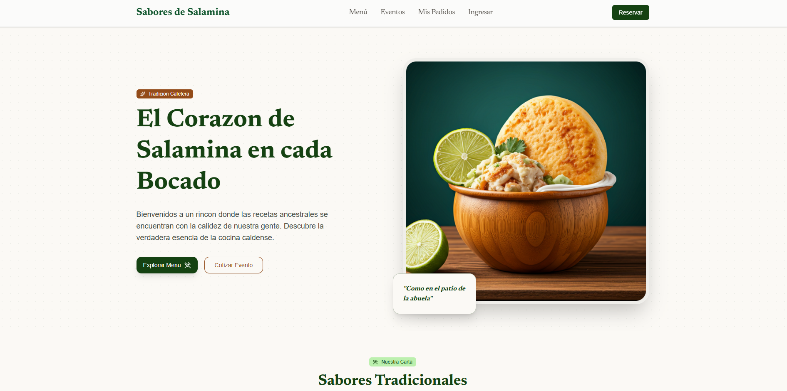

# Sabores de Salamina

Plataforma web para digitalizar procesos operativos y comerciales del restaurante comunitario Sabores de Salamina **(Salamina, Magdalena)**.



## Planteamiento del problema

En el municipio de Salamina, Magdalena, muchos restaurantes de carácter familiar desarrollan sus actividades mediante procesos tradicionales basados en atención presencial y gestión manual de pedidos a través de llamadas telefónicas y aplicaciones de mensajería. Uno de estos establecimientos es el restaurante comunitario Sabores de Salamina, el cual ofrece servicio en el lugar, pedidos a domicilio y atención para eventos sociales como cumpleaños, grados, reuniones familiares y celebraciones especiales mediante servicio tipo buffet.

Actualmente, la gestión de pedidos, registro de clientes y organización de cotizaciones para eventos se realiza de forma manual, lo que genera demoras en la atención, posibles errores en los pedidos, dificultades en el control de descuentos y poca claridad en la administración de clientes frecuentes o con crédito. Además, el restaurante no cuenta con una plataforma digital que permita visualizar de manera estructurada los platos ofrecidos, las bebidas disponibles ni los servicios para eventos, ni tampoco realizar cotizaciones organizadas según número de personas.

En un municipio que ha venido mostrando un crecimiento progresivo en el uso de herramientas tecnológicas, la ausencia de un sistema digital limita la eficiencia del negocio y su capacidad de adaptación a las nuevas dinámicas comerciales. Aunque actualmente el restaurante funciona con recursos básicos, existe la necesidad de iniciar un proceso de digitalización gradual que permita fortalecer la organización interna, mejorar la experiencia del cliente y proyectar un crecimiento futuro.

Por lo anterior, se identifica la necesidad de diseñar una plataforma web estructurada en módulos independientes para la visualización de platos fuertes, menú corriente, bebidas y cotización de eventos, que permita optimizar la gestión del restaurante y contribuir al proceso de transformación digital de pequeños negocios en el municipio de Salamina.

## Objetivo del proyecto

Implementar una aplicación web modular para:

- Mostrar el menú del restaurante por categorías.
- Gestionar pedidos del cliente con carrito persistente.
- Gestionar autenticación básica y perfil de usuario.
- Soportar flujo de cotizaciones para eventos.
- Preparar despliegue en Netlify con runtime para Next.js.

## Evidencia de lo implementado en el repositorio

### Estructura funcional (App Router)

Rutas principales existentes en app/:

```
.
├── admin
│   ├── beverages
│   │   └── new
│   ├── dashboard
│   ├── dishes
│   │   └── new
│   ├── login
│   ├── quotations
│   └── reservations
├── auth
│   ├── login
│   └── signup
├── dashboard
├── eventos
├── menu
├── mi-cuenta
├── profile
├── quotations
│   ├── [id]
│   └── new
└── reservations
```

### Módulos y componentes clave

- Carrito global con contexto React y persistencia en localStorage:
  - lib/carrito-context.tsx
- Autenticación y sesión con Supabase:
  - lib/auth-context.tsx
  - lib/supabase.ts
  - lib/supabase-server.ts
  - lib/supabase-middleware.ts
- Componente reutilizable para agregar productos al pedido:
  - components/ui/add-to-cart-dialog.tsx
- Layout y navegación:
  - app/layout.tsx
  - components/layout/header.tsx
  - components/layout/footer.tsx

### Configuración de despliegue

- netlify.toml con plugin de Next.js y reglas de cache.
- Runtime Netlify para Next.js detectado en build.
- Variables de entorno documentadas en .env.example.

## Stack tecnológico

- Framework: Next.js 16.2.4 (App Router)
- UI: React 19
- Lenguaje: TypeScript 5.7
- Estilos: Tailwind CSS 4 + PostCSS
- Componentes UI: shadcn/ui + Radix UI
- Backend as a Service: Supabase (SSR + cliente web)
- Formularios y validación: React Hook Form + Zod
- Notificaciones: Sonner
- Fechas: date-fns
- Iconografía: lucide-react
- Deploy: Netlify + plugin Next.js

## Variables de entorno

Definidas en .env.example:

```
- NEXT_PUBLIC_SUPABASE_URL
- NEXT_PUBLIC_SUPABASE_ANON_KEY
```

## Scripts disponibles

- npm run dev: inicia entorno local.
- npm run build: genera build de producción.
- npm run start: inicia app en modo producción.
- npm run lint: ejecuta lint del proyecto.

## Ejecución local

1. Instalar dependencias: npm install
2. Configurar variables en .env.local
3. Ejecutar en desarrollo: npm run dev
4. Abrir http://localhost:3000

## Deploy
[sabores salamina](https://app-sabores-salamina.netlify.app/)

## Estado actual

Proyecto funcional con módulos principales de menú, pedidos, autenticación y cotizaciones, más configuración base de despliegue en Netlify.
